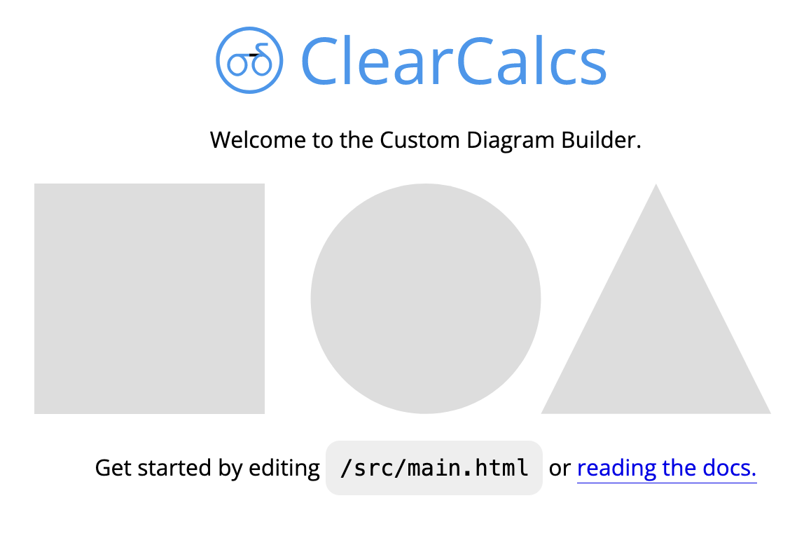
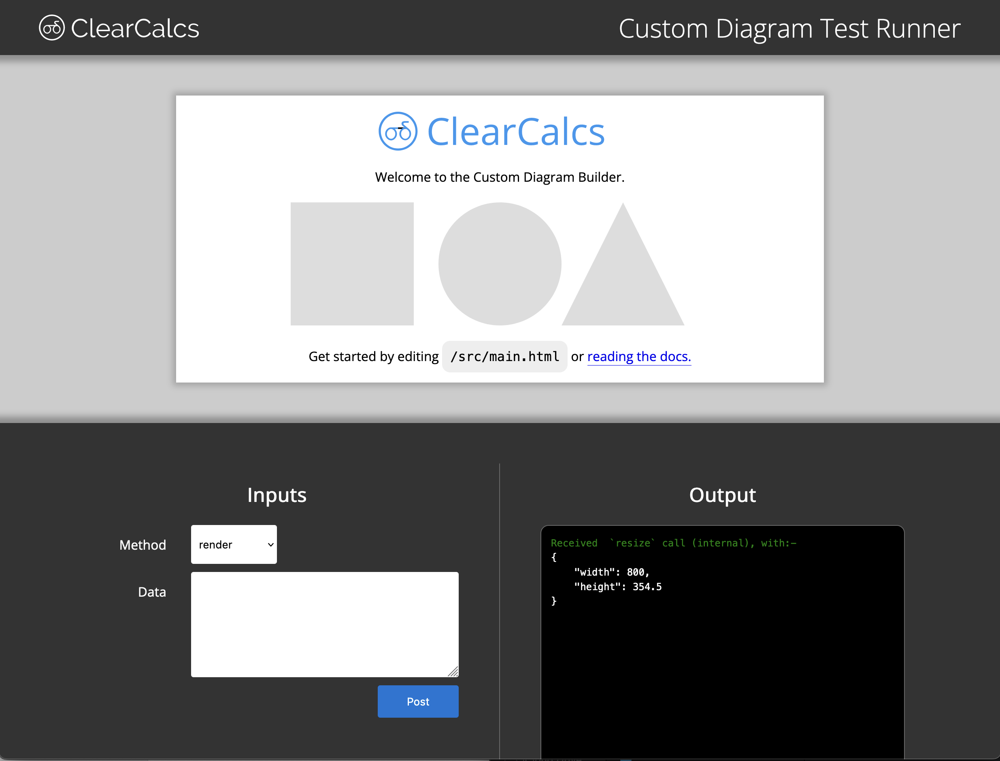

# Quick Start Guide

## Requirements

### NodeJS (version 19 or newer)

?> **For installation instructions for various operating systems.** [https://nodejs.org/en/download/package-manager](https://nodejs.org/en/download/package-manager)

## Installation

1. [Download the code](https://github.com/ClearCalcs/custom-diagram-boilerplate/archive/refs/heads/main.zip) and unzip it. Alternatively, you can clone it from our [Github](https://github.com/ClearCalcs/custom-diagram-boilerplate).
2. In your terminal navigate into the folder containing the code

```
cd path/to/repository/folder
```

3. Install NodeJS dependencies

```
npm install
```

## Getting Started

### Starting the Development Server

While developing your widget, you'll want to start the development server by running the following in your terminal from the folder of your code:
For developing your widget, you can start a web server that will automatically update as you make code changes, by running:

```
npm start
```

?> Once you see `Server running at http://localhost:1234` in your terminal, you'll know the server is running.

This will start a server at [http://localhost:1234](http://localhost:1234), you can open this link in your browser to see your widget running. You should see something like this:



While this server is running, any code changes you make will automatically be updated in the browser. See [Building your widget](/#/guide) for more information on how to start building a widget.

### Starting the Testing Runner

With the development server running, you can start the Test Runner. This will allow you to run your diagram in an environment that simulates the communication your widget will have with the ClearCalcs platform. In a new terminal or terminal tab at the folder of your code, run:

```
npm test
```

?> Once you see `Server running at http://localhost:4321` in your terminal, you'll know the test runner is running.

This will start another server [http://localhost:4321](http://localhost:4321), you can open this link in your browser to see the Test Runner. You should see the following, with your diagram in the box at the box at the top.



The Test Runner will also update automatically with your code changes while it's running. See [Using the Test Runner](/#/guide) for more information on how get the most out of the test runner.
