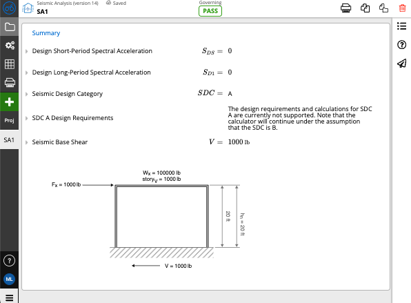
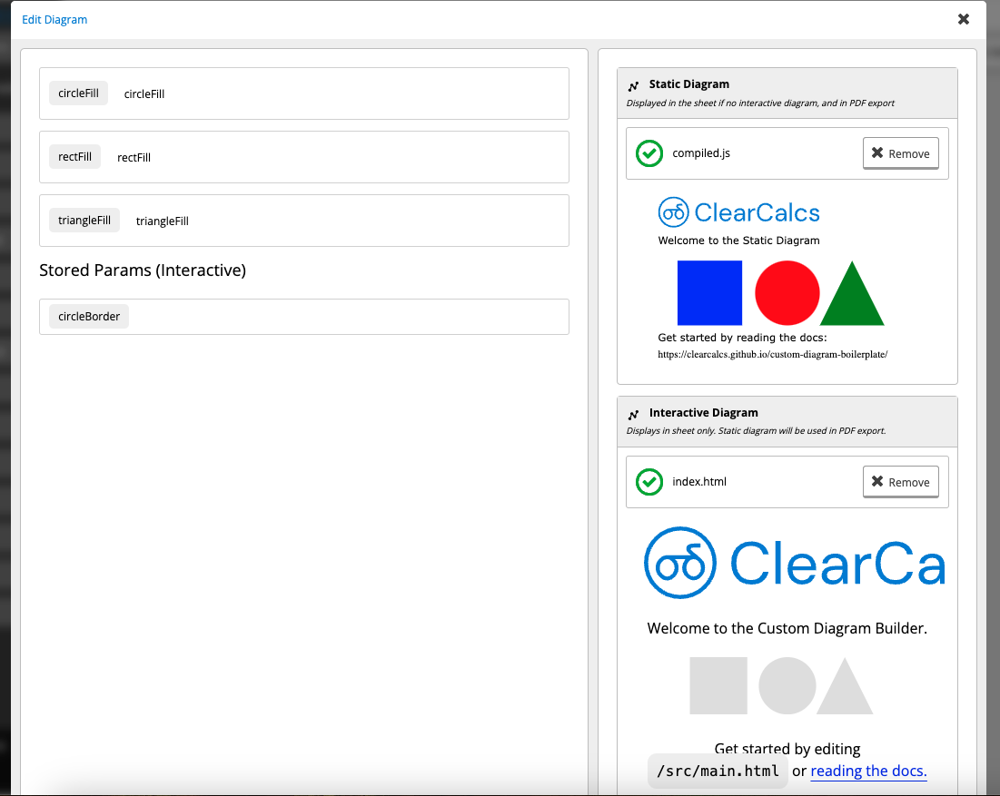

# Quick Start Guide

## Introduction

Custom Diagrams is a method of plugging in visualizations into ClearCalcs calculators. They deliver a full-featured HTML, CSS and Javascript environment to develop the diagram, whilst providing tight integration with the live calculation engine of ClearCalcs.

Rendering occurs in the sheet view on the client in response to new values received from the sheet.



Rendering also occurs on the ClearCalcs' servers in response to a user printing a sheet.

| Feature               | Interactive | Static |
| --------------------- | ----------- | ------ |
| Render in Sheet       | ✅          | ✅     |
| Render in Print       |             | ✅     |
| SVG                   | ✅          | ✅     |
| JS/TS (incl bundling) | ✅          | ✅     |
| Full HTML             | ✅          |        |
| User interaction      | ✅          |        |

?> You can use Interactive & Static diagrams separately or combine together for the best experience!

To start making your own custom diagram, follow the simple setup guide to start developing.
The instructions are targetted towards the interactive diagram, although the process for static diagrams is similar.

## Requirements

### NodeJS (version 19 or newer)

?> **For installation instructions for various operating systems.** [https://nodejs.org/en/download/package-manager](https://nodejs.org/en/download/package-manager)

## Installation

1. [Download the code](https://github.com/ClearCalcs/custom-diagram-boilerplate/archive/refs/heads/main.zip) and unzip it. Alternatively, you can clone it from our [Github](https://github.com/ClearCalcs/custom-diagram-boilerplate).
2. In your terminal navigate into the folder containing the code

```
cd path/to/repository/folder
```

3. Install NodeJS dependencies

```
npm install
```

## Getting Started

### Starting the Development Server

While developing your widget, you'll want to start the development server by running the following in your terminal from the folder of your code:
For developing your widget, you can start a web server that will automatically update as you make code changes, by running:

```
npm start
```

?> Once you see `Server running at http://localhost:1234` in your terminal, you'll know the server is running.

This will start a server at [http://localhost:1234](http://localhost:1234), you can open this link in your browser to see your widget running. You should see something like this:


While this server is running, any code changes you make will automatically be updated in the browser. See [Building your widget](/#/guide) for more information on how to start building a widget.

### Starting the Test Runner

With the development server running, you can start the Test Runner. This will allow you to run your diagram in an environment that simulates the communication your widget will have with the ClearCalcs platform. In a new terminal or terminal tab at the folder of your code, run:

```
npm test
```

?> Once you see `Server running at http://localhost:4321` in your terminal, you'll know the test runner is running.

This will start another server [http://localhost:4321](http://localhost:4321), you can open this link in your browser to see the Test Runner. You should see the following, with your diagram in the box at the box at the top.


The Test Runner will also update automatically with your code changes while it's running. See [Using the Test Runner](/#/guide) for more information on how get the most out of the test runner.

## Develop

[src/main.html](https://github.com/ClearCalcs/custom-diagram-boilerplate/blob/main/src/main.html)

```html
<svg id="svg" viewBox="0 0 500 100">
    <circle id="circle" cx="250" cy="50" r="50" fill="#ddd" />
    <rect id="rect" x="80" y="0" width="100" height="100" fill="#ddd" />
</svg>
```

[src/interface.ts](https://github.com/ClearCalcs/custom-diagram-boilerplate/blob/main/src/interface.ts)

```javascript
export async function initialize() {}

export async function render(params) {
    if (!!params.circleFill) {
        document
            .getElementById("circle")
            ?.setAttribute("fill", params.circleFill);
    }

    if (!!params.rectFill) {
        document.getElementById("rect")?.setAttribute("fill", params.rectFill);
    }
}

export async function params() {
    return [
        { key: "circleFill", type: "string" },
        { key: "rectFill", type: "string" },
    ];
}
```

With the html file and javascript file above, we have created a diagram visualizing 2 simple shapes in a calculator. This diagram can be embedded into a calculator using the calculator builder, and the parameters `circleFill` and `rectFill` can be wired up to other inputs or equations.

On every change of the above parameters, the `render()` function is invoked automatically, causing the shapes' fill colours to be updated in sheet view (and print if using static diagram). `params()` is invoked only when the calculation is first built, to identify the parameters the diagram expects to react to changing values. `initialize()` will run before whenever diagram is first loaded. Use this to initialize any variables event handlers before any render or params calls come in.

## Deploy

-   Contact ClearCalcs to obtain a builder license on [support@clearcalcs.com](mailto:support@clearcalcs.com)

```
npm run-script compile
```

-   Upload `output/index.html` (interactive diagram) into the ClearCalcs builder. Screenshot shows combination of interactive and static diagram, although both are not required.
-   Add values or references to other sheet widgets against each parameter



-   Calculator can now be published for use in your project!
