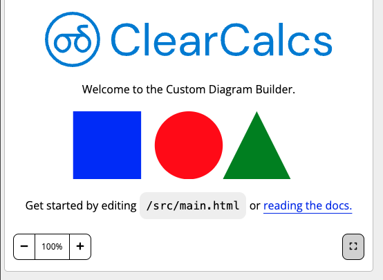
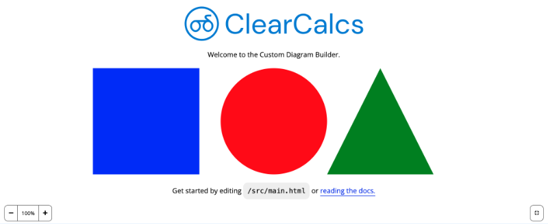

# Global Capabilities

The Custom Diagram engine has several time saving features that are directly built into both interactive as well as static diagrams to give you more out of the box capability e.g. zoom, panning and full screen. These powerful time savers are automatically enabled for all diagrams, and do not need to be custom-built.

## Zoom & Pan

All custom diagrams have zoom controls provided below the diagram that allows the user to zoom and pan. This behaviour can be used both in standard calculator view and [Full Screen](/global-capabilities?id=full-screen).

When a user zooms the diagram, a transform is applied to the original SVG with `transform-origin: 0 0` and `transform: scale([some percentage])`. Every element (e.g. text, stroke-widths and paddings) of the diagram is scaled proportionally from the top-left corner of the diagram as shown below:

<div style="text-align: center;">


</div>

### Supported Features

-   Zoom level from 25% to 400%.
-   Vertical pan (using scroll or trackpad).
-   Horizontal pan (using shift + scroll or trackpad).
-   Supports user interaction while zoomed.

### Unsupported Features

-   Zoom level not persisted between reloads or in print.
-   Pinch-to-zoom not supported.
-   Left or middle-click to pan not supported.
-   Scroll wheel + shift buttons cannot be used for other user interactions.
-   No legend to indicate where in the diagram you are zoomed into.

## Full Screen

The diagram may be rendered in full screen mode ([_link_](https://developer.mozilla.org/en-US/docs/Web/API/Fullscreen_API)). A button is provided at the bottom-right corner as shown below:

Toggle full screen mode:

<div style="text-align: center;">



</div>

Full screen active:

<div style="text-align: center;">



</div>

### Rendering based on Viewport Width

It is desirable that elements look appropriate to the viewport size they are rendered in.
Pure CSS approaches to adjust rendering based on viewport size should be used, as javascript e.g. `render()` method will not be re-run with viewport changes.

For example SVG text elements can be targetted inside a media query:

```css
text {
    font-size: 1em;
}

@media (min-width: 600px) {
    text {
        font-size: 0.8em;
    }
}
```
