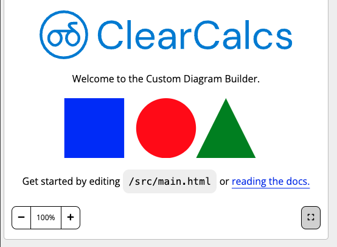
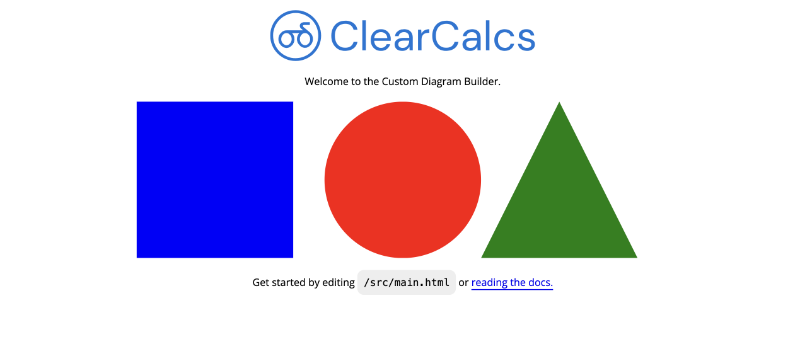

# Global Capabilities

The Custom Diagram engine has several time saving features that will be directly built into both interactive as well as static diagrams to give you more out of the box capability e.g. Zoom, panning, lightbox. These powerful time savers can be toggled on or off, and do not need to be custom-built.

## Zoom & Pan

Zoom in or pan around any part of the diagram. Diagrams should be developed to scale effectively to larger viewports to take full advantage of this upcoming feature.


This feature is still in development.

## Lightbox

The diagram may be rendered in full screen mode ([_link_](https://developer.mozilla.org/en-US/docs/Web/API/Fullscreen_API)). A button is provided at the bottom-right corner as shown below:

Toggle full screen mode:

<div style="text-align: center;">



</div>

Full screen active:

<div style="text-align: center;">



</div>

### Rendering based on Viewport Width

It is desirable that elements look appropriate to the viewport size they are rendered in.
Pure CSS approaches to adjust rendering based on viewport size should be used, as javascript e.g. `render()` method will not be re-run with viewport changes.

For example SVG text elements can be targetted inside a media query:

```css
text {
    font-size: 1em;
}

@media (min-width: 600px) {
    text {
        font-size: 0.8em;
    }
}
```
