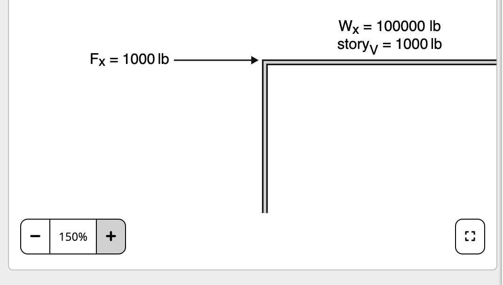
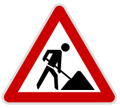

# Global Capabilities

The Custom Diagram engine has several time saving features that will be directly built into both interactive as well as static diagrams to give you more out of the box capability e.g. Zoom, panning, lightbox. These powerful time savers can be toggled on or off, and do not need to be custom-built.

## Zoom & Pan

All custom diagrams have zoom controls provided below the diagram that allows the user to and pan. This behaviour can be used both in standard calculator view and within a full-screen [Lightbox](/global-capabilities?id=lightbox).

When a user zooms the diagram, a transform is applied to the original SVG with `transform-origin: 0 0` and `transform: scale([some percentage])`. Every element (e.g. text, stroke-widths and paddings) of the diagram is scaled proportionally from the top-left corner of the diagram as shown below:

### Supported Features

-   Zoom level from 25% to 400%.
-   Vertical pan (using scroll or trackpad).
-   Horizontal pan (using shift + scroll or trackpad).
-   Supports user interaction while zoomed.

### Unsupported Features

-   Zoom level not persisted between reloads or in print.
-   Pinch-to-zoom not supported.
-   Left or middle-click to pan not supported.
-   Scroll wheel + shift buttons cannot be used for other user interactions.
-   No legend to indicate where in the diagram you are zoomed into.

## Lightbox

The diagram is rendered in a larger window on the user's browser where toggled by the user. Diagrams should be developed to scale effectively to larger viewports i.e. do not use fixed `height` `width` properties on the SVG.

This feature is still in development.
