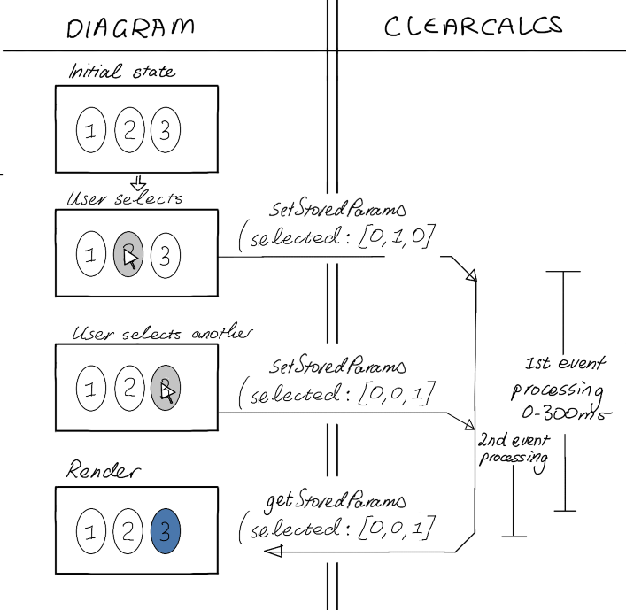

# Interactive Diagram Best Practices

## User Interaction Listeners

### Introduction

Users may interact with the diagram with the intention of modifying one or more of the `storedParams` values. An example is a solar panel grid where each panel may be added/removed via a mouse click, see [Quick Start Guide: Adding Interaction](/quick-start-guide?id=adding-interaction "Adding Interaction").

Event Listeners should be set up in the `initialize` function, which behaves similar to a [load_event](https://developer.mozilla.org/en-US/docs/Web/API/Window/load_event). Consider following best practices:

-   Attach listeners to DOM elements that are static i.e. always persist in DOM.
-   Removing event listeners is not necessary if attached to persistent DOM elements.
-   Use `event.target` to capture events from dynamically added / removed elements on `render`.
-   Do not add listeners for:
    -   `mousemove`/`mouseover`: These may fire rapidly. This will cause poor performance, particularly where `storedParams` are modified on each event. Consider css only approaches.
    -   `scroll`/`scrollend`/`auxclick`: these are utilised by ClearCalcs [Zoom](/global-capabilities?id=zoom-amp-pan).
    -   `keydown`/`keyup` e.g. `Escape` are utilised by ClearCalcs [Lightbox](/global-capabilities?id=lightbox)
    -   `focus`/`blur`: Consider css only approach
    -   `load`: Since the `initialize` function runs on load it performs the same role.

### Examples

#### 1. Single DOM element

[src/interactive/interface.ts](https://github.com/ClearCalcs/custom-diagram-boilerplate/blob/main/src/interactive/interface.ts#L7)

```javascript
export async function initialize(getStoredParams, setStoredParams) {
    document.getElementById("svg")?.addEventListener("click", (event) => {
        if (event.target === document.getElementById("circle")) {
            // Do something
        }
    });
}
```

#### 2. Multiple DOM elements

We can register an event on click of the wrapping [group tag](https://github.com/ClearCalcs/custom-diagram-boilerplate/blob/main/examples/toggle-panels/interactive/main.html#L10). All child panels can then be selected by a common property such as a class name, and checked against the click target.

[examples/toggle-panels/interactive/interface.ts](https://github.com/ClearCalcs/custom-diagram-boilerplate/blob/main/examples/toggle-panels/interactive/interface.ts).

```javascript
export async function initialize(getStoredParams, setStoredParams) {
    document.getElementById("group")?.addEventListener("click", (event) => {
        const elements = document.getElementsByClassName("panel");
        if (Array.from(elements).includes(event.target as Element)) {
            // Do something
        }
    });
}
```

To run the above example, run the following command and upload the `output/index.html`:

```
EXAMPLE=toggle-panels npm run compile-interactive-example
```

## Setting Stored Parameters

### Mental Model

Diagrams are rendered according to inputs from both params i.e. user interacting with upstream widgets, and storedParams i.e. user interacting with diagram itself.

These updates will occur separately from each other and in some cases may have contradictory values.

For example, below a user has made a selection on the diagram when there were 3 panels, but they then updated an upstream widget that changed the number of panels to 1. Their previously selected value no longer exists.

The render in step 7 needs to handle the storedParams value of 2 no longer existing. In this example we can simply not render any selected element.

<div style="text-align: center;">


</div>

### Setting storedParams that depends on previous values

Although the rendering in the above example had to accommodate stale storedParams, it could set new values of storedParams by just overwriting the previous values i.e. not taking them into account.

In the below more complex flowchart for the toggle-panels example [examples/toggle-panels](https://github.com/ClearCalcs/custom-diagram-boilerplate/blob/main/examples/toggle-panels), a user has selected panels 1 and 2. These are stored in an array containing the state of each rendered panel i.e. `[1, 1, 0]`.

The user then changes the number of panels to be rendered in an upstream widget and then interacts with the diagram. To set the new array, the diagram needs to reconcile:

1. currently rendered panel. This can be done by querying the DOM. e.g. panels = 1
2. previous toggled states of panels. This can be done by reading `getStoredParams()` e.g. [1, 1, 0]

The new result then needs to return a new array of toggled states that switches panel 1 and ignores the rest e.g. [0]

<div style="text-align: center;">


</div>

The toggle-panels example provides examples of how to deal with this inter-dependency.

?> Important: the `setStoredParams()` function should only ever be called in response to user interaction, never on `params` changing or other non-user initiated event.

## UX Considerations

### Render Delay after Interaction

ClearCalcs manages the timing of receiving user interaction data and calling render. There is a minor delay where ClearCalcs receives the serialized message from the Interactive Diagram's iframes, stores its value and sends another message with all the `params` and the newly updated `storedParams` for the diagram to render.

The delay may vary based on a number of factors:

-   diagram sends/receives large chunks of data.
-   client is busy performing other computations e.g. solving other maths on the calculator.
-   client is on a low power device.
-   ClearCalcs needs to perform server-side computations to re-calculate `params`.

Below is a simple flow showing a number being clicked and changing its colour to blue. The number may show a delayed switch to blue, but this behaviour is acceptable. There is a minor risk, if the diagram is particularly complex, that the user may try to click again before render is called again. Some advanced strategies are presented in [Handling Duplicate Interactions](/interactive-diagram-best-practices?id=handle-multiple-events).

<div style="text-align: center;">


</div>

#### Optimistic Render

Below is an example of a complex user-interaction that may require strategies to mitigate the number 2 jumping back to its original position at the end of the drag, even if the delay is very short.

This may be achieved by optimistically updating the DOM state within the [dragend](https://developer.mozilla.org/en-US/docs/Web/API/HTMLElement/dragend_event) handler. Some best practices:

-   DOM elements created in event handler should be completely removed at next render.
-   Consider marking optimistic state differently to final state. e.g. light grey, loading spinner. If ClearCalcs fails to calculate, the diagram may never receive the next render.
-   If `storedParams` affect `params` consider showing some optimistic state for that as well. e.g. dimension lines to numbers 1 and 2 are calculated and passed back through `params`.

<div style="text-align: center;">


</div>

#### Handle multiple events

In [examples/toggle-panels](https://github.com/ClearCalcs/custom-diagram-boilerplate/blob/main/examples/toggle-panels), a user can click on multiple panels and the toggle state of every panel is stored in an array. If a user clicks on a 2nd panel while ClearCalcs is still processing the 1st array received from the diagram, the storedParams from the first click may be lost.

The reason for this is that `getStoredParams` function is not instantly updated as soon as `setStoredParams` is called, rather only after ClearCalcs has finished processing and calls render again. Any user interactions in the meantime will get the `storedParams` i.e. before the click/drag event. See flowchart:

<div style="text-align: center;">



</div>

There are some advanced techniques to mitigate these issues, to be used with caution:

-   prevent user interaction until render has been called.
-   use DOM state rather than `getStoredParams` to calculate new `storedParams`.
